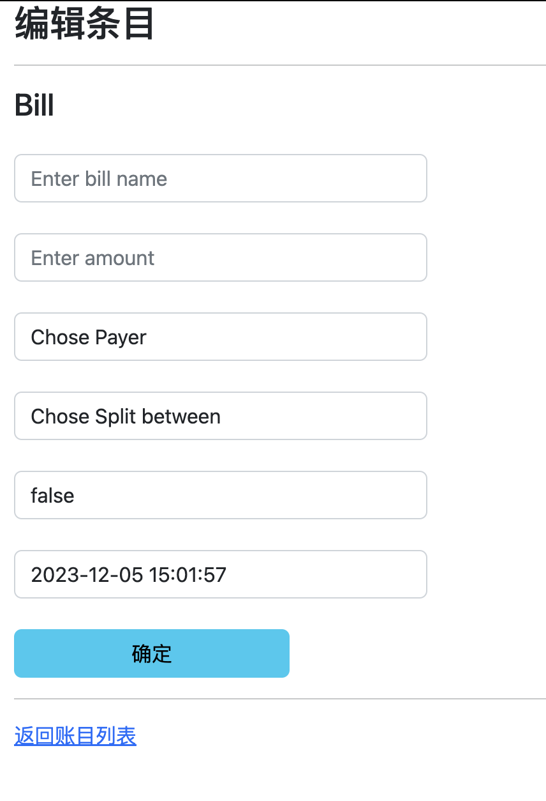

# 03_money_splittor

Here' s the main entrance of the billing system. It displays the current bill, 
history bill and calculation result. 

# 03_money_splittor

Here' s the main entrance of the billing system. It displays the current bill,
history bill and calculation result. For the sake of privacy, I have blurred some data.

#### 1. Create New Entry

Click the blue "New" button below the current statement to create a new entry.

After filling in the respective fields, click confirm to complete the creation of the new entry. By default, "Settled" is set to "No," and the "Date of Entry" is set to the current time.

#### 2. Delete Entry

Click the red "Delete" button on the right side of the entry. A prompt will ask the user to confirm the deletion. This action is irreversible.

#### 3. Modify Entry

Click the blue "Modify" button on the right side of the entry. Modification will redirect you to the same interface as when creating a new entry, but it will fill in all contents based on the current statement information. Click confirm to save the changes.

## 03_money_splittor 分账系统

#### 1. 新建账目

点击本期账单下方的蓝色按钮“新建”，即可新建条目。

依次填写相应空格后点击确定，即可完成新建。其中，是否已结清默认为“否”，入账时间默认为当前时间。

#### 2. 删除条目

点击账单右侧的红色按钮"删除"。删除前会提示用户，是否确认删除。此项操作不可撤销。

#### 3. 修改条目

点击账单右侧的蓝色按钮"修改"。修改时会跳转至与新建账目时相同的界面，但会根据当前账单信息填入所有内容。点击确定即可保存更改。